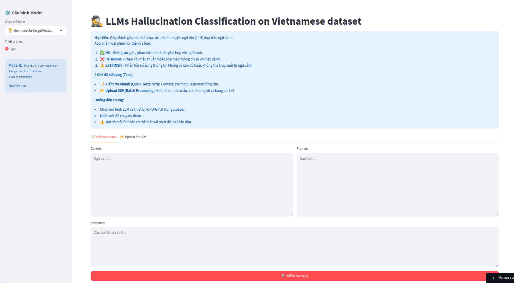
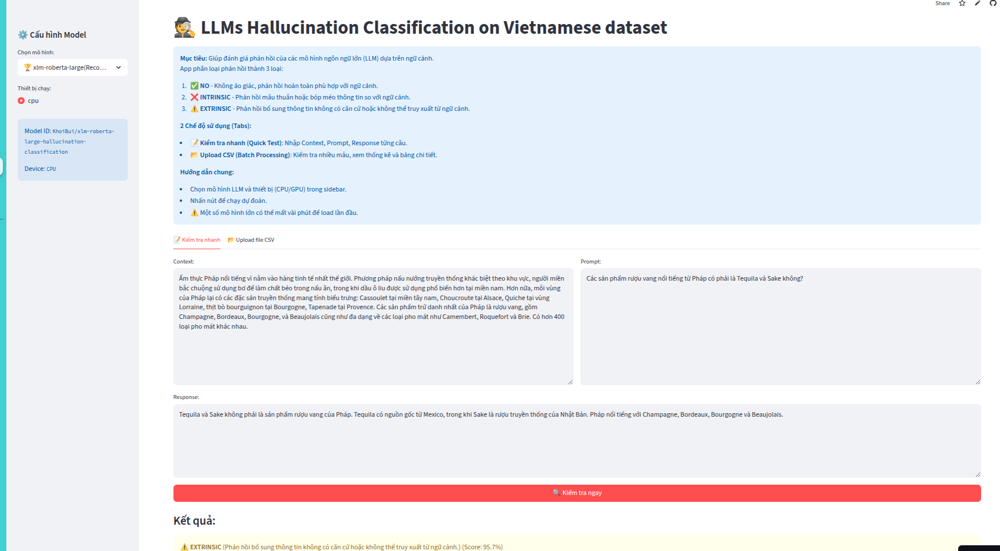
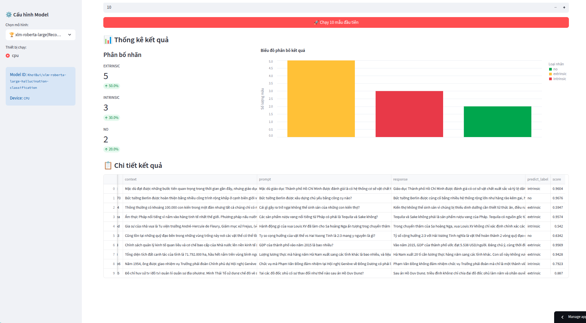
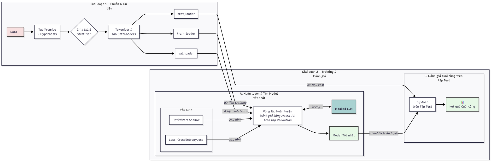

<p align="center">
  <a href="https://www.uit.edu.vn/" title="Trường Đại học Công nghệ Thông tin" style="border: 5;">
    
  </a>
</p>

<!-- Title -->
<h1 align="center"><b>CS221 - Natural Language Processing</b></h1>

## COURSE INFO
* **Course Title**:  Natural Language Processing

* **Course Code**: CS221

* **Class**: CS221.Q13

* **Academic Year**: 2025-2026

## OUR INSTRUCTOR
* TS. **Nguyễn Trọng Chỉnh** - *chinhnt@uit.edu.vn*


## TEAM MEMBER
| STT    | MSSV          | Họ và Tên              | Github                                               | Email                   |
| ------ |:-------------:| ----------------------:|-----------------------------------------------------:|-------------------------:
| 1      | 23520761    | Bùi Nhật Anh Khôi     |[KhoiBui16](https://github.com/KhoiBui16)                 |23520761@gm.uit.edu.vn  |
| 2      | 23520004    | Đinh Lê Bình An    |[BinhAnndapoet](https://github.com/BinhAnndapoet)     |23520004@gm.uit.edu.vn   |
| 3      | 23520713    | Vũ Gia Khang      |[bayvai20kg](https://github.com/bayvai20kg)           |23520713@gm.uit.edu.vn   |

## OUR PROJECT: LLMs Hallucination Classification on Vietnamese dataset 🕵️
This repository contains the final project for the CS221 - Natural Language Processing course, focusing on **LLMs Hallucination Classification on a Vietnamese dataset**. The primary objective is to develop a robust system to classify different types of language hallucinations (when an LLM generates factually incorrect or context-deviating information) in Vietnamese. To achieve this, we have fine-tuned and evaluated several **Masked LLM models** for their ability to verify and categorize a large language model's (LLM) response against a provided context.

## 📊 The Data We Used
Where it came from: [vihallu-train.csv](data/vihallu-train.csv) (7,000 samples)

Getting it ready: We ran Vietnamese spell-checking on it using the [chamdentimem/ViT5_Vietnamese_Correction](https://huggingface.co/chamdentimem/ViT5_Vietnamese_Correction) model. (See: [notebook/preprocessed/vit5-base-vietnamese-correction.ipynb](notebook/preprocessed/vit5-base-vietnamese-correction.ipynb).

How we split it: The dataset was split up like this:

Train: 5,600 samples

Validation: 700 samples

Test: 700 samples

How we trained: You can find the main training notebook in [notebook/train/train_masked_llm_v4_new_prompt_datacollator_BEST.ipynb](notebook/train/train_masked_llm_v4_new_prompt_datacollator_BEST.ipynb)

## 🚀 Try it Live!

Go ahead and test the application live on Streamlit Cloud: [(https://uit-cs221-llms-hallucination-classification.streamlit.app/)](https://uit-cs221-llms-hallucination-classification.streamlit.app/)

## 🖼️ How it Looks
- **UI_demo**

- **UI_result_1**

- **UI_result_2**


## 📋 Table of Contents
* [App Features](#appfeatures)

* [Our Fine-Tuned Models (on Hugging Face)](#finetunemodelhf)

* [Project Workflow](#projectworkflow)

* [Project Structure](#projectstructure)

* [How to Install](#howtoinstall)

* [How to Run it Locally](#howtorunitlocally)

* [Running Inference Directly (CLI)](#cli)

* [API Endpoints (FastAPI)](#endpoint)

* [Tech Stacks](#techstacks)

## ✨ App Features
<a name="appfeatures"></a>

Our app checks an LLM's response and sorts it into one of three buckets, based on how truthful it is to the context:

* ✅ **NO**: The response is 100% consistent and backed up by the context.

* ⚠️ **EXTRINSIC**: The response adds new info that isn't in the context. We can't verify it.

* ❌ **INTRINSIC**: The response straight-up contradicts or twists the info that's already in the context.

You can use the app in two ways:

* 📝 **Quick Test**: Lets you test a single (Context, Prompt, Response) input.

* 📂 **Upload CSV (Batch Processing)**: Upload a whole CSV file with lots of samples. The app will run through all of them, show you the results in a table, and even give you some charts to see the breakdown.


## 🤗 Our Fine-Tuned Models (on Hugging Face)
<a name="finetunemodelhf"></a>

We ended up fine-tuning four different base models for this: **[FacebookAI/xlm-roberta-large](https://huggingface.co/FacebookAI/xlm-roberta-large)**, **[joeddav/xlm-roberta-large-xnli](https://huggingface.co/joeddav/xlm-roberta-large-xnli)**, **[microsoft/infoxlm-large](https://huggingface.co/microsoft/infoxlm-large)**, and **[uitnlp/CafeBERT](https://huggingface.co/uitnlp/CafeBERT)**. They were all trained on the preprocessed (spell-checked) Vietnamese data. You can find the resulting models on Hugging Face!
- [KhoiBui/CafeBERT-hallucination-classification](https://huggingface.co/KhoiBui/CafeBERT-hallucination-classification)
- [KhoiBui/infoxlm-large-hallucination-classification](https://huggingface.co/KhoiBui/infoxlm-large-hallucination-classification)
- [KhoiBui/xlm-roberta-large-xnli-hallucination-classification](https://huggingface.co/KhoiBui/xlm-roberta-large-xnli-hallucination-classification)
- [KhoiBui/xlm-roberta-large-hallucination-classification](https://huggingface.co/KhoiBui/xlm-roberta-large-hallucination-classification)


## 🔬 Project Workflow
<a name="projectworkflow"></a>



This project follows a standard NLP pipeline, from data preparation to model deployment.

* **Data**: The core dataset is vihallu (e.g., [vihallu-train.csv](data/vihallu-train.csv)). The data was split into 5600 Train, 700 Validation, and 700 Test samples.

* **Preprocessing**: Before training, the Vietnamese text data was cleaned and corrected for spelling errors using the **chamdentimem/ViT5_Vietnamese_Correction** model. (See: [notebook/preprocessed/vit5-base-vietnamese-correction.ipynb](notebook/preprocessed/vit5-base-vietnamese-correction.ipynb)).

* **Training**: We fine-tuned several `Masked Language Models (LLMs) on the NLI-formatted` hallucination dataset. We structured the input as a premise/hypothesis pair based on the insight that `(Q + C) => R` is a strong assumption:


  - `Premise`: Câu hỏi: [PROMPT] Ngữ cảnh: [CONTEXT]

  - `Hypothesis`: [RESPONSE]

To handle **class imbalance** and prevent overfitting, we applied **Class Weights** and **Label Smoothing** to the loss function during training.

The main training script used is [notebook/train/train_masked_llm_v4_new_prompt_datacollator_BEST.ipynb](notebook/train/train_masked_llm_v4_new_prompt_datacollator_BEST.ipynb).

* **Evaluation**: Models were evaluated on the test set. The best-performing checkpoints (trained on both original and preprocessed data) are saved in **best_models_train_val_test/**.

* **Deployment**: The system is served via a Streamlit (frontend) and FastAPI (backend) application, with a core [app/inference_module.py](app/inference_module.py) handling the logic.

## 📂 Project Structure
<a name="projectstructure"></a>

```bash
UIT_CS221_Basic_Natural_Language_Processing/
├── app/
│   ├── app.py                                                          # Main Streamlit app (for cloud deployment)
│   ├── app_fastapi.py                                                  # Local backend API (FastAPI)
│   ├── app_streamlit_local.py                                          # Local frontend UI (Streamlit)
│   ├── run_app.py                                                      # Script to run both local client & server
│   └── inference_module.py                                             # Core logic for model loading and prediction
├── notebook/
│   ├── EDA/                                                            # Exploratory Data Analysis notebooks
│   ├── preprocessed/                                                   # Notebooks for data preprocessing
│   │   └── vit5-base-vietnamese-correction.ipynb
│   └── train/                                                          # Notebooks for model training
│       └── train_masked_llm_v4_new_prompt_datacollator_BEST.ipynb
├── data/
│   ├── vihallu-train.csv                                               # Original training data
│   └── vihallu-public-test.csv                                         # Original public test data
├── Results/
│   ├── original-data/                                                  # Model results on original data
│   └── preprocessed-data/                                              # Model results on preprocessed data
├── envs/
│   ├── .env                                                            # For storing environment variables (e.g., HF_TOKEN)
│   └── requirements.txt                                                # Python dependencies
├── environment.yml                                                     # Conda environment file
└── README.md                                                           # This file!

```

## 💾 How to Install
<a name="howtoinstall"></a>
Follow these steps to get the project set up on your own machine:

**1. First, clone this repo:**
```bash
git clone https://github.com/KhoiBui16/UIT_CS221_Basic_Natural_Language_Processing.git
cd UIT_CS221_Basic_Natural_Language_Processing

```

**2. Next, create and activate a Python environment:**
* Using Conda (recommended):
```bash
conda env create -f environment.yml
conda activate cs221

```

* Using venv:
```bash
python -m venv env
source env/bin/activate  # On Windows: env\Scripts\activate
```

**3. Install all the needed packages:**
(If you didn't use Conda)
```bash
pip install -r envs/requirements.txt
```

**4. Set up your environment variables:**
* Create a file named .env inside the envs/ directory.
* envs/.env
* You might need to add a Hugging Face token here if you're using private models:
  ```bash
  HUGGING_FACE_TOKEN="your_hf_token_here"
  ```

## 🚀 How to Run it Locally
<a name="howtorunitlocally"></a>
* We've got two ways for you to run the app:

### **Option 1: Standalone Streamlit App (Cloud Version)**
  
  This runs the exact same version that's on Streamlit Cloud. It just loads the models right into the Streamlit app.

  ```bash
  streamlit run app/app.py
  ```

You'll find the app running at [http://localhost:8501](http://localhost:8501).

### **Option 2: Client-Server (FastAPI + Streamlit)**
  This way runs a local client-server setup. The backend (API) and the frontend (UI) run in separate processes.
    
* On **Linux/macOS**: You can use the provided helper script to launch both services at once:
  ```bash
  python app/run_app.py
  ```
* On Windows (or manually):
The `run_app.py` script will not work on Windows as it uses Linux-specific commands. You must run the two services manually in two separate terminals.

1. Terminal 1 (Run Backend): (Make sure your environment is activated)
```bash
   uvicorn app.app_fastapi:app --host localhost --port 8095
```

2. Terminal 2 (Run Frontend): (Make sure your environment is activated)
```bash
   streamlit run app/app_streamlit_local.py --server.port 8505
```

You can then access them here:

* **Frontend (Streamlit)**: [http://localhost:8505](http://localhost:8505)

* **Backend (FastAPI Docs)**: [http://localhost:8095/docs](http://localhost:8095/docs)

## 🔬 Running Inference Directly (CLI)
<a name="cli"></a>

> For users who wish to perform batch inference directly from the command line without launching the Streamlit application, we provide a dedicated inference script.

You can run **app/inference_module.py** directly. This script is designed to process a CSV file and output the results to a new CSV file.
```bash
python app/inference_module.py --csv <path_to_your_csv_file> --model <model_name_or_path> [--output <output_filename>] [--device <cpu/cuda>]
```

* Argument Descriptions:
  ```plain

    --csv <path_to_your_csv_file>: (Required) The full path to the input CSV file you want to process. The file must contain columns for context, prompt, and response.

    --model <model_name_or_path>: (Required) The Hugging Face model name (e.g., KhoiBui/CafeBERT-hallucination-classification) or a path to a local directory containing a saved model.

    --output <output_filename>: (Optional) The name for the resulting CSV file. If not provided, it defaults to results.csv.

    --device <cpu/cuda>: (Optional) The device to run the model on. It defaults to cuda if a compatible GPU is available, otherwise it falls back to cpu.
  ```

## 💡 API Endpoints (FastAPI)
<a name="endpoint"></a>

When running the full stack (Option 2), a FastAPI backend serves the models.

* **Base URL**: [http://localhost:8095](http://localhost:8095)

### GET /health

* **Description**: Checks if the API is running and what device (CPU/GPU) is being used.

* **Response**:
  ```json
  {
    "status": "ok",
    "device": "cuda",
    "gpu": "NVIDIA GeForce RTX 5070Ti"
  }
  ```

### POST /predict_batch

* **Description**: Performs hallucination classification on a batch of inputs.

* **Request Body**:
  ```json
  {
    "data": [
      {
        "id": 1,
        "context": "Thủ đô của Úc là Canberra.",
        "prompt": "Thủ đô của Úc là gì?",
        "response": "Thủ đô của Úc là Sydney."
      },
      {
        "id": 2,
        "context": "Mèo là động vật có vú.",
        "prompt": "Con mèo là gì?",
        "response": "Mèo là động vật có vú, thuộc họ Felidae."
      }
    ],
    "model_name": "KhoiBui/xlm-roberta-large-hallucination-classification"
  }
  ```

* **Response:**
  ```json
  [
    {
      "id": 1,
      "context": "Thủ đô của Úc là Canberra.",
      "prompt": "Thủ đô của Úc là gì?",
      "response": "Thủ đô của Úc là Sydney.",
      "label_pred": "intrinsic",
      "score": 0.9982
    },
    {
      "id": 2,
      "context": "Mèo là động vật có vú.",
      "prompt": "Con mèo là gì?",
      "response": "Mèo là động vật có vú, thuộc họ Felidae.",
      "label_pred": "extrinsic",
      "score": 0.9851
    }
  ]
  ```

## 🛠️ Tech Stacks
<a name="techstacks"></a>

* Python 3.12

* PyTorch

* Hugging Face

* Pandas

* Streamlit

* FastAP

* Jupyter Notebook

## 📜 License
This project is licensed under the MIT License. Check out the [LICENSE]() file for all the details! 
